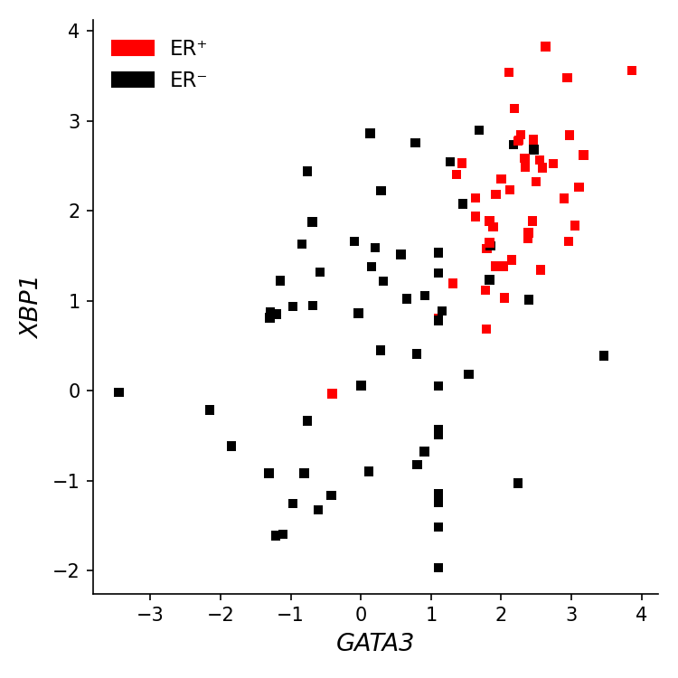
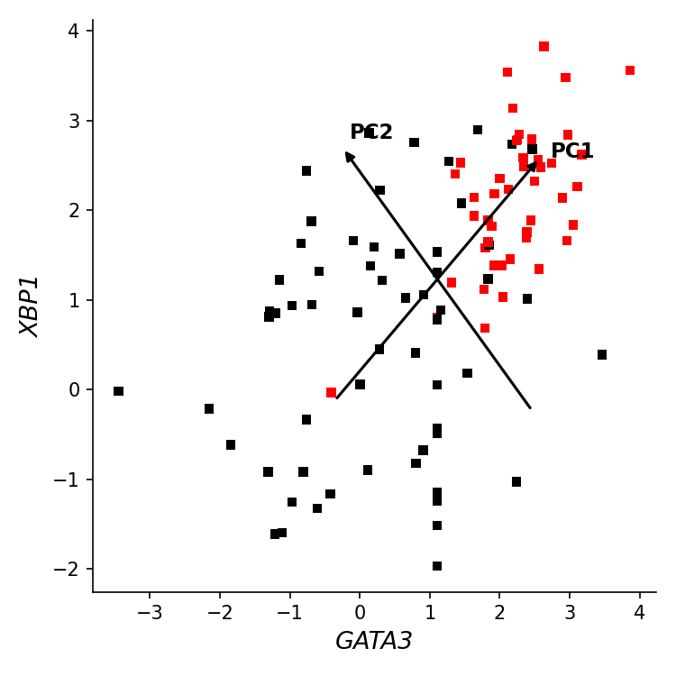
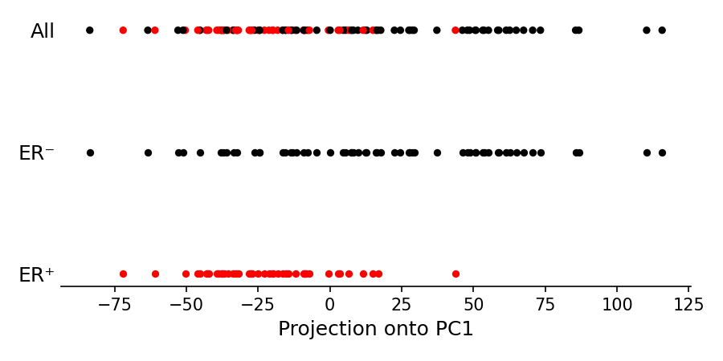

# PCA on Breast Cancer Gene Expression Data — Report

## 1. Introduction

Breast cancers are classified based on the expression of certain receptors. One important distinction is between **ER+ (estrogen receptor positive)** and **ER- (estrogen receptor negative)** tumors. These two subtypes respond differently to treatment — ER+ tumors respond to hormone therapy (e.g., tamoxifen), while ER- tumors do not and require chemotherapy instead. Identifying them accurately is therefore critical for treatment planning.

This project uses gene expression data from the GEO dataset [GSE5325](https://www.ncbi.nlm.nih.gov/geo/query/acc.cgi?acc=GSE5325), which contains expression profiles of **105 breast cancer patients** across **16,173 genes**. We reproduce parts of Figure 1 from the [Nature Primer on PCA (Ringnér, 2008)](https://www.nature.com/articles/nbt0308-303), demonstrating how Principal Component Analysis can reveal biologically meaningful structure in high-dimensional gene expression data.

---

## 2. Dataset Description

The data consists of three files:

| File | Description |
|------|-------------|
| `data/class.tsv` | Class labels for 105 patients: 1 = ER+, 0 = ER- |
| `data/filtered.tsv.gz` | Expression matrix (105 patients × 16,173 genes), values are normalized |
| `data/columns.tsv.gz` | Gene ID to gene name/symbol mapping |

From the class labels:
- **58 patients** are ER+ (label = 1)
- **47 patients** are ER- (label = 0)

---

## 3. Reference Figure from the Paper

Below is the reference figure from the Nature Primer that we aim to reproduce (panels **a**, **b**, **c**, and **d**):


---

## 4. Figure 1a — XBP1 vs GATA3 Scatter Plot

### What we did

Using the gene ID mapping file (`columns.tsv.gz`), we identified:
- **XBP1** corresponds to gene ID **4404**
- **GATA3** corresponds to gene ID **4359**

We extracted the expression values of these two genes for all 105 patients and plotted them as a scatter plot. Each point represents one patient, colored by their ER status:
- **Black squares** = ER- patients
- **Red squares** = ER+ patients

### Result



### Observations

- There is a clear **positive correlation** between GATA3 and XBP1 expression — patients with high GATA3 tend to also have high XBP1.
- **ER+ patients (red)** cluster in the **upper-right** region, meaning they have high expression of both genes.
- **ER- patients (black)** are more spread out and tend to occupy the **lower-left** region.
- The two classes are not perfectly separable using just these two genes, but a clear trend is visible — which matches exactly what the paper reports.

---

## 5. Figure 1b — PCA Directions on the Scatter Plot

### What we did

After computing PCA on the 2D data (GATA3 and XBP1 expression values only), we overlaid the directions of PC1 and PC2 on the same scatter plot. The two principal component directions are drawn as arrows passing through the data center (mean):

- **PC1** — the direction of maximum variance, running roughly from lower-left to upper-right, aligned with the positive correlation between GATA3 and XBP1.
- **PC2** — perpendicular to PC1, running from lower-right to upper-left, capturing the remaining variance.

### Result



### Observations

- The **PC1 direction** aligns with the main trend in the data — it captures the shared increase in both GATA3 and XBP1 expression. This is why projecting onto PC1 separates ER+ from ER-.
- The **PC2 direction** is perpendicular and captures the remaining variance, mostly within-class variation or noise.
- The two arrows form a new coordinate system centered at the data mean. PCA essentially rotates the original axes (GATA3, XBP1) into these new directions, making the biological signal easier to extract.

---

## 6. Figure 1c — Projection onto PC1 (Full Matrix PCA)

### What is PCA?

Principal Component Analysis (PCA) finds the directions of maximum variance in the data. When applied to the full gene expression matrix (105 patients × 16,173 genes), PCA finds a set of orthogonal axes:
- **PC1**: the direction along which the data varies the most across all genes
- **PC2**: perpendicular to PC1, captures the next most variance
- And so on...

### What we did

1. Built the full expression matrix (105 × 16,173).
2. **Standardized** the data using z-score normalization (mean = 0, std = 1 per gene).
3. Ran **PCA** using scikit-learn on the standardized matrix.
4. Projected all 105 patients onto **PC1** to get a single number per patient.
5. Plotted three horizontal dot strips:
   - **All**: all 105 patients coloured by ER status
   - **ER−**: only ER- patients (black)
   - **ER+**: only ER+ patients (red)

### Result



### Observations

- After projecting onto PC1, the **ER+ and ER- groups become clearly separated** along a single axis.
- **ER+ patients (red)** cluster on the **left/negative** side of PC1.
- **ER- patients (black)** spread across the **right/positive** side of PC1.
- This demonstrates the power of PCA: by finding the direction of maximum variance across thousands of genes, it naturally separates the two cancer subtypes — without ever being told the labels.
- The separation is not perfect (some overlap exists), but the trend is strong and closely matches the paper.

---

## 7. Code Summary

The analysis script (`pca_breast_cancer.py`) performs the following steps:

1. **Loads** the expression matrix, class labels, and gene ID mapping
2. **Extracts** XBP1 (ID 4404) and GATA3 (ID 4359) expression values
3. **Plots Figure 1a** — scatter plot of XBP1 vs GATA3, coloured by ER status
4. **Runs 2D PCA** on just GATA3 and XBP1:
   - Fits PCA to find the principal axes in the 2-gene space
   - Overlays PC1 and PC2 direction arrows on the scatter plot → **Figure 1b**
5. **Runs full PCA** on the standardized 105 × 16,173 matrix using scikit-learn:
   - Projects every patient onto PC1
   - Plots the three-strip dot plot → **Figure 1c**

### Dependencies

Install the required libraries using:
```bash
pip install pandas numpy matplotlib scikit-learn
```

### How to Run

Place the `data/` folder (containing all three data files) in the same directory as the script, then run:
```bash
python pca_breast_cancer.py
```

Three PNG figures will be generated in the same folder.

---

## 8. Conclusion

Using just two genes (XBP1 and GATA3), we can already see a pattern distinguishing ER+ and ER- breast cancer patients. The scatter plot (Figure 1a) shows ER+ patients clustering in the high-expression region. Overlaying the PCA axes (Figure 1b) reveals that the direction of maximum variance (PC1) aligns with the correlation between these two genes.

Running PCA on the full genome-wide expression matrix (Figure 1c) and projecting onto PC1 reduces 16,173 dimensions to a single axis that cleanly separates the two cancer subtypes — without using the labels at any point.

This project demonstrates how unsupervised dimensionality reduction techniques like PCA can uncover clinically meaningful structure in high-dimensional genomic data — a foundational idea in computational biology and precision medicine.
